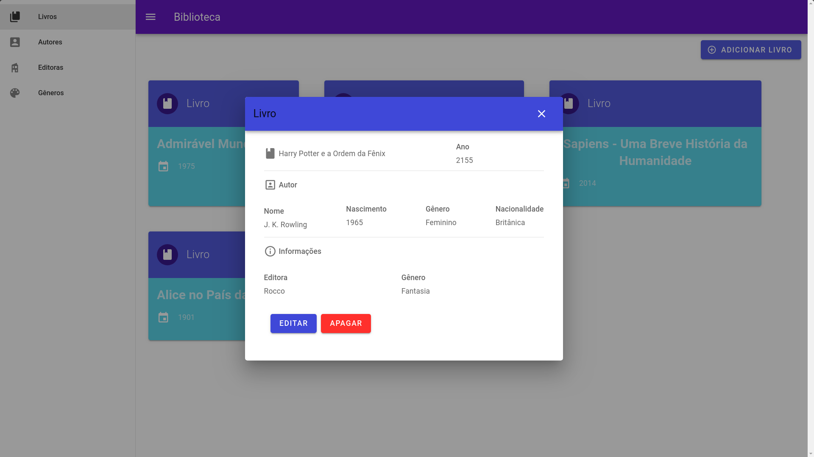

# Desafio Técnico Unyleya

> O desafio consiste em desenvolver um sistema para gerenciamento de biblioteca através de uma aplicação REST backend em PHP e consumir através de um frontend.

## Aplicação



## Instalação Local
### Pré Rrequisitos
- Node
- Yarn ou Npm

> https://docs.npmjs.com/downloading-and-installing-node-js-and-npm

> https://classic.yarnpkg.com/en/docs/install/#debian-stable

Após clonar o repositório, dentro da pasta do projeto execute:

```sh
# Através do yarn
yarn install
yarn serve

# Ou com npm
npm install
npm serve
```
O servidor de desenvolvimento estará disponível em:
> http://localhost:5555/


## Arquitetura

- **Vue:** Vue é um framework progressivo para a construção de interfaces de usuário. Tem como destaque a excelente performance e o pequeno tamanho de bundle.

- **Vuex:** O Vuex é um padrão de gerenciamento de estado na arquitetura flux para aplicativos Vue.js. Ele serve como um store centralizado para todos os componentes da aplicação, com regras garantindo que o estado só possa ser mutado de forma previsível. 

- **Vuetify** Biblioteca para aplicação de layout em projetos Vue.js.

- **Axios:** Axios é a famosa e útil biblioteca para se trabalhar com chamadas Api de forma simples e de fácil configuração.

<!-- Markdown link & img dfn's -->

[duck]: https://github.com/erikras/ducks-modular-redux
